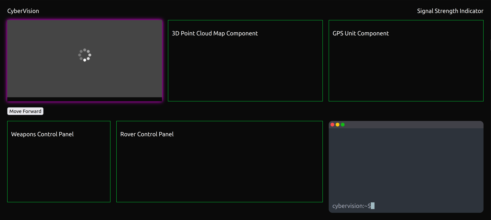

# CyberVision for Cerberus

This project unlocks the full potential of the Cerberus rover. Visualize its surroundings, analyze real-time data, and issue commands - all through a unified, intuitive interface.

This project was made using React. Please run `npm install` and `npm start` when using this project.